<!--
  This README is generated automatically by NeoQuantumForge.
  Do not edit by hand -- run `python main.py` or wait for the daily
  GitHub Actions workflow. See scripts/build_readme.py.
-->

<table>
<tr>
<td valign="top" width="42%">

</td>
<td valign="top" width="58%">

</td>
</tr>
</table>

### Connect

  

### Built With

   

Last generated 2026-07-16 07:22 UTC &middot; regenerated daily via GitHub Actions &middot;
powered by <a href="https://github.com/NeoQuantumForge/NeoQuantumForge">NeoQuantumForge</a>

<!--
  Mobile degradation note: the <table> layout above collapses gracefully
  on narrow viewports because GitHub's mobile renderer stacks table cells
  vertically once the viewport drops below the table's natural width, and
  each embedded SVG uses width="100%" so it scales down rather than
  overflowing.
-->
